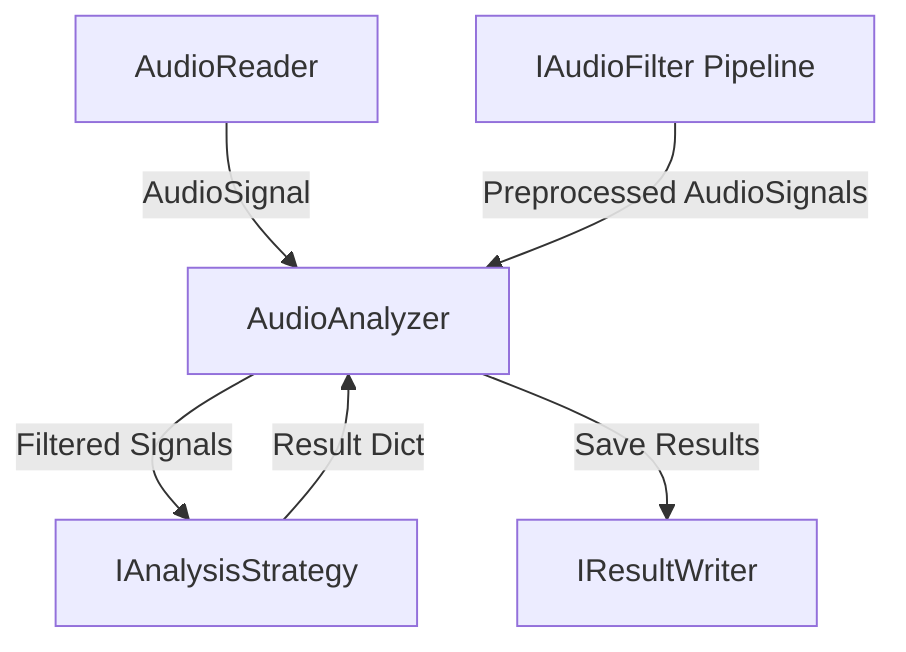

# Audio Analyzer (音声解析システム)

本プロジェクトは、音声ファイルの読み込み、前処理（フィルタリング）、および各種解析（BPM検出、類似度計算、ジャンル判定）を行うための高精度な音声解析システムです。
DI（依存性の注入）パターン、Strategy（戦略）パターン、および Filter Pipeline（前処理フィルタ）パターンを組み合わせた、クリーンで拡張性の高いアーキテクチャを採用しています。

---

## 🛠️ 技術スタック & 主な依存関係

- **言語**: Python 3.9+
- **音声処理コア**: `librosa` (v0.11.0+)
- **数値計算・科学技術計算**: `numpy`, `scipy`
- **音声入出力デコーダ**: `soundfile` (WAV高速デコード), `audioread` (MP3, OGGなどの汎用デコード)

---

## 🏗️ アーキテクチャ設計

システムは主に以下の4つのモジュールで構成され、疎結合になるようインターフェースを介して構築されています。



### 1. データモデル (`model/`)

- **[AudioSignal](model/AudioSignal.py)**: 読み込まれた音声波形データ（`numpy`配列）とサンプリング周波数、再生時間をカプセル化した共通データ構造。

### 2. 音声読み込みモジュール (`reader/`)

- **`IAudioReader`**: 音声ファイルの読込インターフェース。
- **`WavAudioReader`**: 標準 `wave` ライブラリを使用した高速WAVデコーダ。
- **`LibrosaAudioReader`**: `librosa` を使用したMP3, WAV, OGG等に対応するマルチフォーマットデコーダ。

### 3. 前処理フィルターモジュール (`analyzer/filter/`)

- **`IAudioFilter`**: 辞書形式の複数音声シグナルを受け取って加工し、辞書を返す前処理インターフェース。
- **`BandSplitterFilter`**: `scipy.signal` を用いて音声を低域（<150Hz）と高域（>=150Hz）の2つの信号に分割し、辞書に追加します（キックやベース抽出によるBPM検出の精度向上に寄与）。
- **`CompressorFilter`**: 指定された特定のシグナルに対して音圧圧縮を適用し、ビートのアタックを際立たせます。
- **`SourceSeparatorFilter`**: ドラムやボーカル等の音源分離処理を行う。

### 4. 解析戦略モジュール (`analyzer/strategy/`)

- **`IAnalysisStrategy`**: 解析アルゴリズムをカプセル化するインターフェース。
- **`SimpleBeatStrategy`**: `librosa.beat.beat_track` を利用した高精度なBPM・テンポ検出。
- **`SlidingWindowBeatStrategy`**: 楽曲を10秒単位の時間窓で区切り、時間経過による変拍子やテンポ遷移をトラッキング。
- **`AudioSimilarityStrategy`**: 音色（MFCC）と音階・コード構成（Chroma CENS）の双方のコサイン類似度を別個に計算し、ハイブリッド評価を行う類似度推定。
- **`GenreClassificationStrategy`**: BPM、明るさ（スペクトル重心）、ゼロ交差率に加え、ノイズ度（スペクトル平坦度）と高域特性（ロールオフ周波数）を組み合わせた詳細な決定木ルールに基づく音楽ジャンル判定。

---

## 📂 ディレクトリ構成

```text
audio_analyzer/
├── analyzer/                  # 解析コア
│   ├── AudioAnalyzer.py       # コンテキストクラス (パイプラインの統合)
│   ├── IAnalysisStrategy.py   # 解析戦略インターフェース
│   ├── filter/                # 事前処理フィルター
│   │   ├── IAudioFilter.py
│   │   ├── BandSplitterFilter.py
│   │   ├── CompressorFilter.py
│   │   └── SourceSeparatorFilter.py
│   └── strategy/              # 各解析アルゴリズムの実装
│       ├── SimpleBeatStrategy.py
│       ├── SlidingWindowBeatStrategy.py
│       ├── AudioSimilarityStrategy.py
│       └── GenreClassificationStrategy.py
├── model/                     # データモデル
│   └── AudioSignal.py
├── reader/                    # 音声デコーダ
│   ├── IAudioReader.py
│   ├── AudioReader.py
│   └── LibrosaAudioReader.py
├── writer/                    # 結果保存
│   ├── IResultWriter.py
│   └── JsonResultWriter.py
├── tests/                     # 単体テストスイート
│   ├── __init__.py
│   ├── test_reader.py
│   ├── test_writer.py
│   ├── test_analyzer.py
│   ├── test_filter.py
│   └── test_strategies.py
├── main.py                    # サンプル実行エントリポイント
├── requirements.txt           # 依存パッケージ定義
└── README.md                  # 本ファイル
```

---

## 🚀 セットアップ

1. **仮想環境の作成と有効化**:

   ```bash
   python -m venv .venv
   # Windows (Command Prompt)
   .venv\Scripts\activate.bat
   # Windows (PowerShell)
   .venv\Scripts\Activate.ps1
   # macOS / Linux
   source .venv/bin/activate
   ```

2. **依存関係のインストール**:
   ```bash
   pip install --upgrade pip
   pip install -r requirements.txt
   ```

---

## 💻 使用方法

付属のサンプルコード `main.py` を実行することで、フィルター適用から4つの解析処理（簡易BPM、変拍子BPM、ジャンル、類似度）までの一連のパイプライン動作を検証できます。

```bash
python main.py
```

### 結果ファイル

実行すると、以下のJSON解析結果がルートディレクトリに出力されます。

- `result_simple.json` (BPM解析結果)
- `result_complex.json` (時系列テンポトラッキング結果)
- `result_genre.json` (音楽ジャンル判定・音響特徴量データ)
- `result_similarity.json` (音色・音階ブレンド類似度)

---

## 🧪 テストの実行

Pythonの標準機能を用いて、すべてのクラスの単体テストを一括実行できます。

```bash
python -m unittest discover -s tests -p "test_*.py"
```
